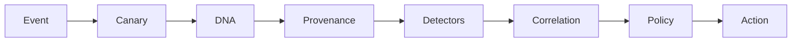

# How It Works

## Detection Pipeline

## Event

Interceptors emit structured runtime events for LLM prompts/responses, tool calls, memory operations, and session lifecycle checkpoints. This event stream is the canonical substrate for all downstream analysis and auditing.

## Canary

Canary scanning checks LLM responses and tool outputs for session-bound secret tokens. If a token is echoed, AgentShield treats that as active manipulation with near-zero false positives and immediately raises a BLOCK outcome.

## DNA

The DNA subsystem continuously observes per-session behavior and tracks session features for baseline learning and anomaly scoring. Session-end anomaly evaluation compares current behavior against clean historical baselines.

## Provenance

Provenance tagging classifies content trust level (`TRUSTED`, `INTERNAL`, `EXTERNAL`, `UNTRUSTED`) before detector correlation. Trust labels support stricter handling for suspicious source chains and inter-agent flows.

## Detectors

Specialized detectors evaluate threat families: prompt injection, goal drift, tool-chain escalation, memory poisoning, and inter-agent injection. Each detector emits structured evidence and a recommended action.

## Correlation

The correlation stage fuses all detector outputs for an event and applies escalation rules to reduce one-off false positives. It also enforces canary-triggered immediate block semantics.

## Policy

The policy evaluator applies built-in or custom YAML rules against event context and detector findings. Policy decisions can suppress, log, flag, alert, or block regardless of individual detector action bands.

## Action

Final outcomes include telemetry emission, alert routing, or hard-stop enforcement via `PolicyViolationError`. All outcomes are recorded in the audit chain for forensic replay.

## Cross-Detector Correlation Logic

- `1 detector` -> action is capped at `ALERT`.
- `2 detectors` -> escalation applies (`FLAG -> ALERT`, `ALERT -> BLOCK`).
- `3+ detectors` -> action is always `BLOCK`.
- `canary_triggered=True` -> immediate `BLOCK` always.